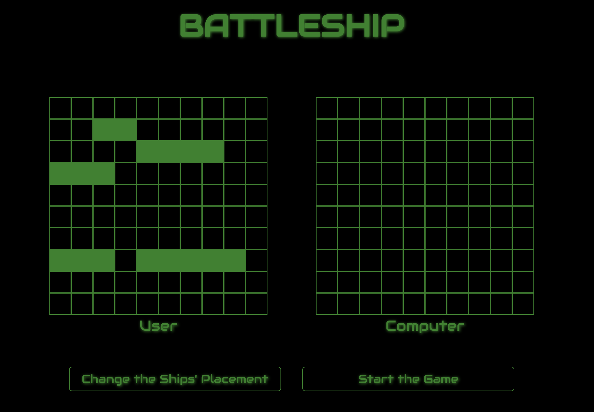

# Battleship Game
This is a web-based implementation of the classic Battleship game, where players place ships on a 10x10 grid and take turns attacking each other to sink all ships. The game includes features like random ship placement, user vs. AI battles, and an interactive board to visualize the game.

## 🎬 Demo

## 🔨 Game Setup
The game is implemented using JavaScript, HTML, and CSS. It runs in the browser with no external dependencies.

### Game Logic
- **Player Class**: Manages the player’s information, including their gameboard and ship status.
- **Ship Class**: Represents a ship, tracks the number of hits, and determines if the ship is sunk.
- **Gameboard Class**: Handles the 10x10 grid, ship placement, attack logic, and board resets.
- **Render Functions**: Renders the gameboard to the DOM and updates it based on the game state (hit/miss).
- **Game Flow**: The player places ships, then starts the game. During the game, the player and computer take turns attacking until one party sinks all the ships of the opponent.

## 🕹 How to Play
1. Place Your Ships:
- You can place your ships by clicking the "Place Ships" button. This will randomly position your ships on the grid.

2. Start the Game:
- Click the "Start Game" button to initialize the game. The player and the computer’s ships are placed randomly on their respective boards.

3. Gameplay:
- The game starts once the "Start Game" button is pressed. On each turn, the player can click on a cell in the computer's grid to attack it.
- If you hit a ship, the cell will show a "hit" marker. If you miss, the cell will show an "X".
- The computer will retaliate by randomly selecting a target on your board.

4. Winning:
- The first player to sink all of their opponent’s ships wins the game.
- A game over message will appear indicating the winner.

5. Restart the Game:
- Press the "Restart" button to start a new game after one ends.